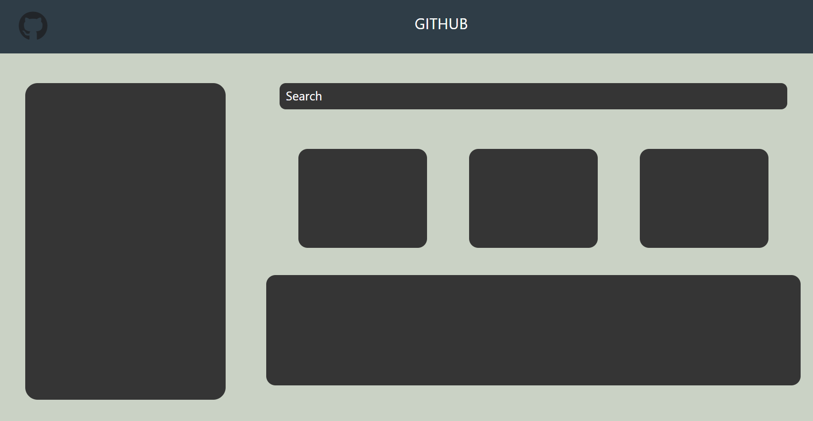

## GITHUB PROFILE PAGE DESIGN TASK

> Designing GITHUB Profile page using Html and CSS

- [Click Here](./index.html) for Html Code.

- [Click Here](./css/styles.css) for CSS Styling.

- [Click Here](https://github-profilepage-design-task.netlify.app/) for web preview